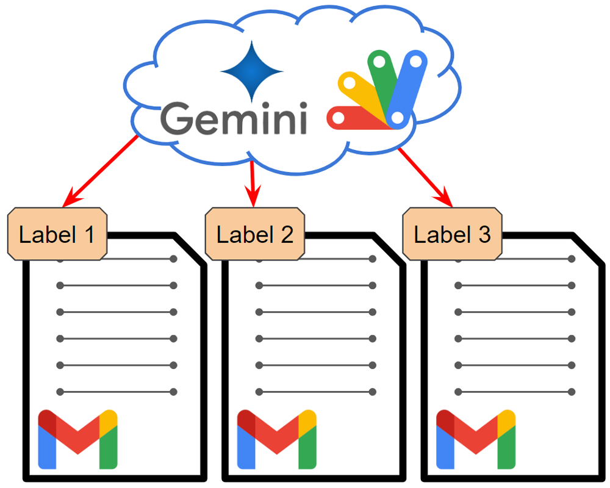

# Flexible Labeling for Gmail using Gemini API with Google Apps Script Part 3

<a name="top"></a>
[](LICENCE)



<a name="overview"></a>

# Overview

This report improves Gmail email labeling with Gemini API using JSON schema and leverages advancements in Gemini 1.5 Flash for faster processing.

# Description

As Gemini continues to evolve, existing scripts utilizing its capabilities can be revisited to improve efficiency and accuracy. This includes the process of flexible labeling for Gmail emails using the Gemini API. I have previously explored this topic in two reports:

- December 19, 2023: Demonstrating Gmail label selection based solely on prompts. [Ref](https://medium.com/google-cloud/flexible-labeling-for-gmail-using-gemini-pro-api-with-google-apps-script-5bf2ee7c9f52)
- January 30, 2024: Exploring label selection through both semantic search and function calls. [Ref](https://medium.com/google-cloud/flexible-labeling-for-gmail-using-gemini-pro-api-with-google-apps-script-part-2-08015af6b2e6)

This report introduces a new method for Gmail label selection using a JSON schema with response_mime_type: "application/json". Thanks to Gemini's advancements, content generation speed has significantly improved with the introduction of Gemini 1.5 Flash. Additionally, JSON schema allows for greater control over the output format. Recent research [Ref](https://medium.com/google-cloud/taming-the-wild-output-effective-control-of-gemini-api-response-formats-with-response-schema-ae0097b97502) suggests that this combination outperforms the previous approach using response_mime_type and response_schema separately.

To facilitate the use of the Gemini API with Google Apps Script, a custom library named "GeminiWithFiles" was created. [Ref](https://medium.com/google-cloud/batch-processing-powerhouse-leverage-gemini-1-5-2857fd7fe28d) and [Ref](https://github.com/tanaikech/GeminiWithFiles) This library is also utilized within this report.

This report concludes by presenting the latest script for flexible Gmail email labeling using the Gemini API with Google Apps Script.

# Feature
The feature of this script is as follows.

- **Automated Gmail Labeling**: Automatically add labels to Gmails using the Gemini API with Google Apps Script.
- **Batch Processing**: Process multiple emails efficiently with a single API call. [Ref](https://medium.com/google-cloud/batch-processing-powerhouse-leverage-gemini-1-5-2857fd7fe28d)
- **Structured Data Handling**: Utilize JSON schemas for both input and output data with the Gemini API.
- **Scheduled Execution**: Leverage time-driven triggers for automatic script execution.
- **Cost-Effective and Accurate**: Achieve low processing costs and high accuracy through Gemini 1.5 Flash, JSON schemas, and batch processing.

# Usage

## 1. Create a Google Apps Script project
Please create a Google Apps Script project. In this case, both the container-bound script and the standalone script can be used.

## 2. Create an API key

Please access [https://ai.google.dev/gemini-api/docs/api-key](https://ai.google.dev/gemini-api/docs/api-key) and create your API key. At that time, please enable Generative Language API at the API console. This API key is used for this sample script.

This official document can also be seen. [Ref](https://ai.google.dev/).

Of course, if you can link the Google Cloud Platform Project to the Google Apps Script Project in the copied Spreadsheet, you can also use the access token.

## 3. Install a Google Apps Script library

In this script, a Google Apps Script library GeminiWithFiles is used. Please install it. You can see how to install it [here](https://github.com/tanaikech/GeminiWithFiles?tab=readme-ov-file#1-use-geminiwithfiles-as-a-google-apps-script-library).

## 4. Script: Class object
This is the class object. Please copy and paste the following script to the script editor of your created Google Apps Script project.

```javascript
/**
 * Class object for automtically adding labels to Gmail using Gemini API.
 * Author: Kanshi Tanaike
 * Repository: https://github.com/tanaikech/Flexible-Labeling-for-Gmail-using-Gemini-API-with-Google-Apps-Script-Part-3
 * @class
 */
class AddLabel {

  /**
    * @param {Object} object Object using this script.
    * @param {String} object.functionName Function name of the function you run.
    * @param {String} object.apiKey API key for using Gemini API.
    * @param {Object[]} object.labelObj Label names on Gmail and the description of the label.
    * @param {Number} object.n Number of emails in one API call. Default is 5.
    * @param {Number} object.triggerTime Cycle time for executing the script. Default is 10. The unit is minute.
    */
  constructor(object) {
    /** @private */
    this.object = object;

    /** @private */
    this.now = new Date();

    /** @private */
    this.p = PropertiesService.getScriptProperties();

    /** @private */
    this.prev = this.p.getProperty("prev");
  }

  /**
   * ### Description
   * Main method.
   *
   * @return {String} Return result value.
   */
  run() {
    this.checkObject_();
    const messages = this.getNewMessages_();
    const res = this.callGemini_(messages);
    this.setTrigger_(this.object.functionName);
    return res;
  }

  /**
   * ### Description
   * Check the inputted object.
   *
   * @return {void}
   * @private
   */
  checkObject_() {
    if (!this.object.functionName) {
      throw new Error("Please set functionName.");
    }
    if (!this.object.apiKey) {
      throw new Error("Please set apiKey.");
    }
    if (!this.object.labelObj || !Array.isArray(this.object.labelObj)) {
      throw new Error("Please set valid labelObj.");
    }
    if (!this.object.labelObj.some(({ label }) => label == "INBOX")) {
      this.object.labelObj.push({ label: "INBOX", description: "Others" });
    }
    if (!this.object.n) {
      this.object.n = 5;
    }
    if (!this.object.triggerTime) {
      this.object.triggerTime = 10;
    }
  }

  /**
   * ### Description
   * Get threads of Gmail.
   *
   * @return {Object} Return an object including thread IDs and messages.
   * @private
   */
  getNewMessages_() {
    const nowTime = this.now.getTime();
    if (!this.prev) {
      this.prev = nowTime - 60 * 60 * 1000; // If you run this script for the first time or prev is undefined, emails from your inbox in the past 1 hour are retrieved.
    }
    const threads = GmailApp.getInboxThreads().filter(t => t.getLastMessageDate().getTime() > Number(this.prev));
    this.p.setProperty("prev", nowTime.toString());
    if (threads.length == 0) return [];
    const res = threads.map(thread => {
      const lastMessageDate = thread.getLastMessageDate().getTime();
      const lastMessage = thread.getMessages().find((m) => m.getDate().getTime() == lastMessageDate);
      return { threadId: thread.getId(), message: lastMessage.getPlainBody() };
    });
    return res;
  }

  /**
   * ### Description
   * Request Gemini API.
   *
   * @param {Array} labelObj Array including label names.
   * @param {Array} messages Array including thread IDs and messages from Gmail.
   * @return {Object} Return an object including thread IDs and messages.
   * @private
   */
  createPrompt_(labelObj, messages) {
    const jsonSchema1 = {
      description: "Emails including threadId and message.",
      type: "array",
      items: {
        type: "object",
        properties: {
          threadId: { description: "Thread ID of Gmail.", type: "string" },
          message: { description: "Email body.", type: "string" },
        },
      },
    };

    const jsonSchema2 = {
      description: "List of labels including descriptions of the labels.",
      type: "array",
      items: {
        type: "object",
        properties: {
          label: { description: "Label name.", type: "string" },
          description: { description: "Description of the label.", type: "string" },
        },
      },
    };

    const jsonSchema3 = {
      description: `Select the label names from "Array1".`,
      type: "array",
      items: {
        type: "object",
        properties: {
          label: { description: "Selected label name.", type: "string" },
          threadId: { description: "Thread ID of Gmail.", type: "string" },
        },
      },
    };

    const prompt = [
      `Run the following steps in order.`,
      `1. Read and understand the messages from the following array including JSON data "Array1".`,
      `<Array1>${JSON.stringify(messages)}</Array1>`,
      `JSON schema "JsonSchema1" of this array is as following JSON schema "JsonSchema1".`,
      `<JsonSchema1>${JSON.stringify(jsonSchema1)}</JsonSchema1>`,
      `2. Read and understand the following array "Array2".`,
      `<Array2>${JSON.stringify(labelObj)}</Array2>`,
      `JSON schema "JsonSchema2" of this array is as following JSON schema "JsonSchema2".`,
      `<JsonSchema2>${JSON.stringify(jsonSchema2)}</JsonSchema2>`,
      `3. For each element in "Array1", export a single element including the selected label from "Array2" strongly related to the message.`,
      `Output the result with the following JSON schema "JsonSchema3".`,
      `<JsonSchema3>${JSON.stringify(jsonSchema3)}</JsonSchema3>`,
      `<IMPORTANT>`,
      `- One element in "Array1" must have only one label name.`,
      `- Length of "Array1" must be the same length of output array "JsonSchema3".`,
      `</IMPORTANT>`,
    ].join("\n");
    return prompt;
  }

  /**
   * ### Description
   * Request Gemini API.
   *
   * @param {Array} messages Array including thread IDs and messages from Gmail.
   * @return {Object} Return an object including thread IDs and messages.
   * @private
   */
  callGemini_(messages) {
    const len = messages.length;
    if (len > 0) {
      const n = this.object.n;
      const splitMessages = [...Array(Math.ceil(messages.length / n))].map(_ => messages.splice(0, n));
      splitMessages.forEach(msgs => {
        const q = this.createPrompt_(this.object.labelObj, msgs);
        const g = new GeminiWithFiles.geminiWithFiles({ apiKey: this.object.apiKey, response_mime_type: "application/json", exportTotalTokens: true });
        const { returnValue, usageMetadata } = g.generateContent({ q });
        if (!returnValue || !Array.isArray(returnValue)) {
          console.warn("Gemini returns invalid value. Those mails will be processed again.");
          this.p.setProperty("prev", this.prev.toString());
        } else {
          returnValue.forEach(({ label, threadId }) => {
            if (label && label != "INBOX") {
              const thread = GmailApp.getThreadById(threadId);
              console.log(`Mail subject: ${thread.getMessages()[0].getSubject()}, labeled to "${label}"`);
              console.log(`Token information for Gemini: totalTokenCount is ${usageMetadata.totalTokenCount}.`);
              const l = GmailApp.getUserLabelByName(label) || GmailApp.createLabel(label);
              GmailApp.getThreadById(threadId).moveToArchive().addLabel(l).refresh();
            }
          });
        }
      });
    }
    return `${this.now.toISOString()}: ${len} mails were processed.`;
  }

  /**
   * ### Description
   * Request Gemini API.
   *
   * @param {String} functionName Function name.
   * @return {void}
   * @private
   */
  setTrigger_(functionName) {
    ScriptApp.getProjectTriggers().forEach(t => {
      if (t.getHandlerFunction() == functionName) {
        ScriptApp.deleteTrigger(t);
      }
    });
    ScriptApp.newTrigger(functionName).timeBased().everyMinutes(this.object.triggerTime).create();
  }

}
```

## 5. Script: Main function
This is the main function for using the above class object. Please copy and paste the following script to the script editor of your created Google Apps Script project.

Please set your API key and URLs to the function `main`.

```javascript
function main() {
  const functionName = "main"; // Please set the function name of this function.

  // Please set your API key for using Gemini API.
  const apiKey = "###";

  // Please set your label names on Gmail and the description of the label. Please modify this for your situation.
  const labelObj = [
    { label: "academic", description: "Related to university, laboratory, research, education, and etc." },
    { label: "commission", description: "Related to a comission, a request, a job offer, orders, and etc." },
    { label: "advertisement", description: "Related to advertisement, new product, and etc." },
    { label: "INBOX", description: "Others" },
  ];

  const n = 5; // Number of emails in one API call.

  const triggerTime = 10; // In this case, the script is automatically run every 10 minutes.

  const res = new AddLabel({ functionName, apiKey, labelObj, n, triggerTime }).run();
  console.log(res);
}
```

## 6: Testing
When you manually run `main` function, the emails are retrieved from "INBOX" of Gmail. And, those mails are processed and your inputted labels are added to the emails. And, the time-driven trigger for automatically executing the script is also installed. By this, the script `main` is automatically run by the installed  time-driven trigger.

---

<a name="licence"></a>

# Licence

[MIT](LICENCE)

<a name="author"></a>

# Author

[Tanaike](https://tanaikech.github.io/about/)

[Donate](https://tanaikech.github.io/donate/)

<a name="updatehistory"></a>

# Update History

- v1.0.0 (September 19, 2024)

  1. Initial release.

[TOP](#top)


